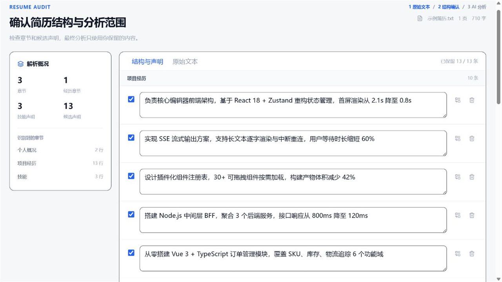
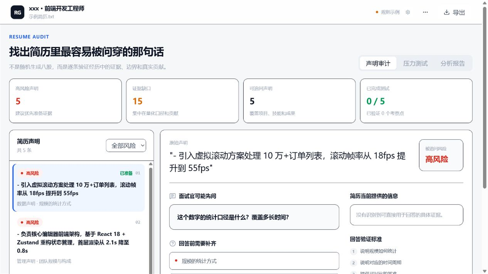
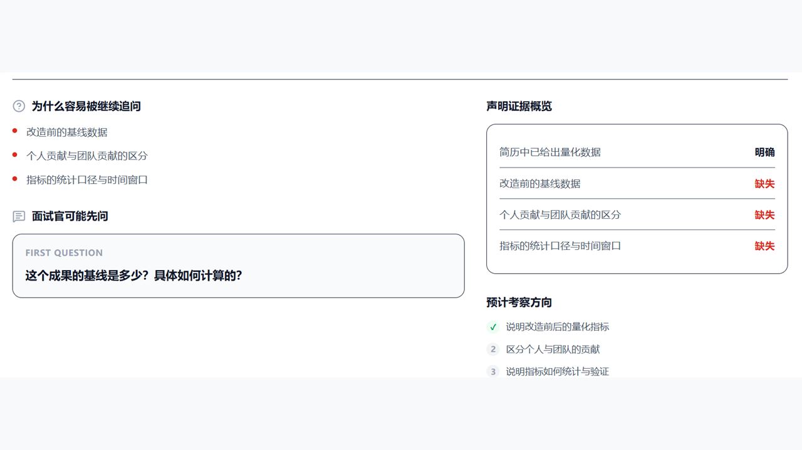
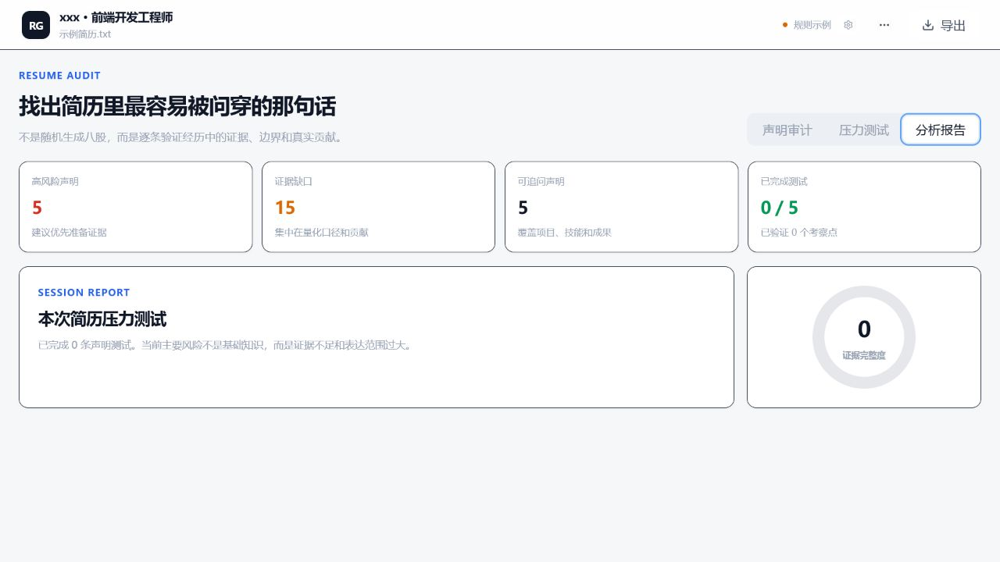

<p align="center">
  <picture>
    <source media="(prefers-color-scheme: dark)" srcset="public/favicon.svg">
    
  </picture>
</p>

<h1 align="center">Resume Grill</h1>

<p align="center">
  
  
  
  
</p>

---

Resume Grill 检查简历内容是否经得起追问。它从简历中提取项目、职责、技能和成果，生成与原文强相关的问题，再根据多轮回答整理证据缺口和待补强内容。

> 当前版本面向个人在本机运行，暂未提供线上部署方案。

## 功能概览

| 环节 | 说明 |
|------|------|
|  简历导入 | 支持 PDF、TXT、Markdown 和直接粘贴文本 |
|  本地解析 | PDF 在浏览器端由 PDF.js 解析，无需上传原始文件 |
|  提取校对 | 识别个人信息、教育、工作、实习、项目、技能、奖项等章节，支持人工修正 |
|  陈述管理 | 从职责、技能、成果、数据等维度生成可追问陈述，支持删改、合并与优先级设定 |
|  岗位匹配 | 可选填岗位描述，检查 JD 要求是否有对应简历证据 |
|  多轮追问 | 每条陈述进行 3~5 轮追问，覆盖点按回答累计计算 |
|  不懂批注 | 标记术语请求通俗解释，澄清轮次不计入追问与覆盖统计 |
|  分析报告 | 汇总已确认事实、证据缺口、改写建议和待补强盲区 |
|  盲区管理 | 标记盲区为已掌握，基于原陈述创建新测试版本 |
|  导出 | 支持导出 Markdown 格式报告 |

未配置模型时，应用仍可提供基于规则的简历分析预览。连续追问、回答判断和复盘需要一个可用的 OpenAI Chat Completions 兼容接口。

## 界面预览

<table>
  <tr>
    <td align="center"><strong>简历确认</strong><br/>检查解析结果，选择保留的陈述</td>
    <td align="center"><strong>声明审计</strong><br/>查看风险、证据缺口和追问重点</td>
  </tr>
  <tr>
    <td></td>
    <td></td>
  </tr>
  <tr>
    <td align="center"><strong>面试追问</strong><br/>追问原因、当前问题、已有证据与考察方向</td>
    <td align="center"><strong>分析报告</strong><br/>证据完整度、缺口与待补强盲区</td>
  </tr>
  <tr>
    <td></td>
    <td></td>
  </tr>
</table>

## 快速开始

**前置要求：** Node.js ≥ 20.9

```bash
npm install
npm run dev
```

打开 [http://localhost:3000](http://localhost:3000) 即可使用。

```bash
# 提交前检查
npm run lint
npm test
npm run build
```

仓库附带示例材料，可体验完整流程：

- [示例简历](examples/sample-resume.txt)
- [示例岗位描述](examples/sample-job-description.txt)
- [材料说明](examples/README.md)
- [发布前验收清单](examples/evaluation-checklist.md)

## 模型配置

项目使用 OpenAI Chat Completions 兼容接口，提供两种本地配置方式。

### 环境变量（推荐）

复制 `.env.example` 为 `.env.local`：

```bash
OPENAI_BASE_URL=https://api.openai.com/v1
OPENAI_API_KEY=sk-…
OPENAI_MODEL=gpt-4o-mini
```

API Key 仅由本机 Next.js Route Handler 读取，不会发送到前端。

### 浏览器设置

点击页面右上角模型设置图标，填写 `Base URL`、`API Key` 和 `Model`。配置保存在 `localStorage` 中，请求经同源 API 转发至模型服务商。

> 浏览器配置适合个人本机使用，不适合部署到不受信任的公开站点。

### 自建模型 / Ollama

Ollama 等本地模型通常使用本机或局域网地址。项目默认拦截此类地址以降低 SSRF 风险，确需访问时可在服务端配置白名单：

```bash
ALLOWED_LLM_BASE_URLS=http://127.0.0.1:11434
```

多个地址用逗号分隔。

## 数据流与隐私

| 阶段 | 数据去向 |
|------|----------|
| PDF 解析 | 浏览器本地（PDF.js），原始文件不上传 |
| 简历文本 | 提交至同源 API |
| 模型调用 | 简历文本、岗位描述、面试回答发送至所选模型服务商 |
| 面试记录 | 浏览器 IndexedDB |
| 模型配置 | 浏览器 `localStorage` |

---

<p align="center">
  <a href="./LICENSE">MIT License</a> · <a href="./issues">提交反馈</a>
</p>
