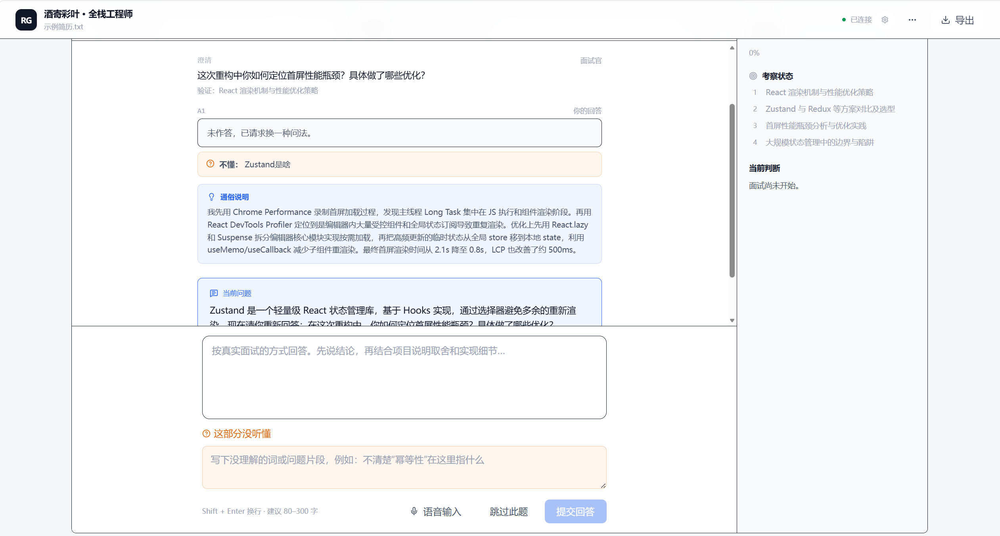
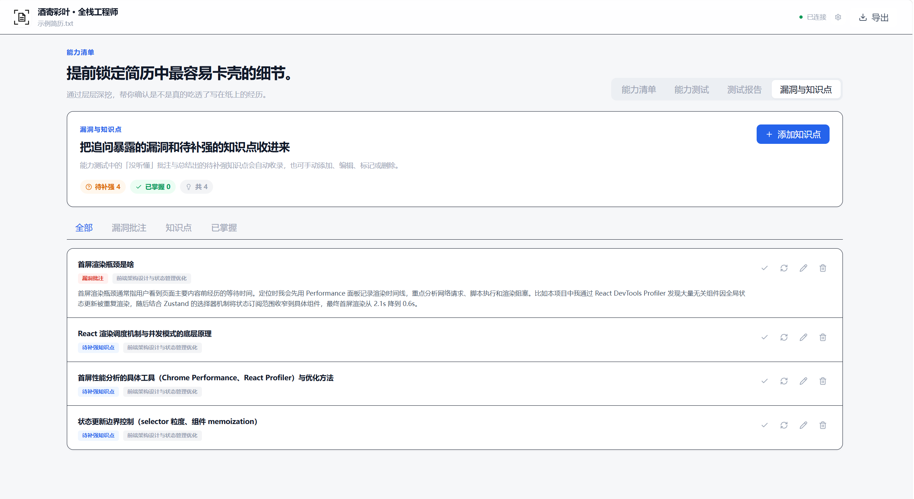

<p align="center">
  <picture>
    <source media="(prefers-color-scheme: dark)" srcset="public/favicon.svg">
    
  </picture>
</p>

<h1 align="center">Resume Grill</h1>

<p align="center">
  
  
  
  
</p>

---

Resume Grill 是个人求职工作台。可以从官网招聘页整理邮箱投递，也可以导入简历检查内容、结构和表达，再练习面试回答、回看需要补充的内容。

建议只针对简历文字和这次回答。练习分数表示本次回答讲清了多少，不作为实际工作能力或录用结果的判断。改写只使用用户提供的事实，缺少的信息留给用户补充。

> 当前版本面向个人在本机运行，暂未提供线上部署方案。

## 功能概览

| 环节 | 说明 |
|------|------|
|  邮箱投递 | 批量粘贴官网招聘链接，自动整理公司、岗位、招聘邮箱、主题和基础正文；统一预览后通过本机 QQ／163 邮箱逐封发送，支持暂停、记录恢复和防重复 |
|  简历导入 | 支持 PDF、DOCX、TXT、Markdown 和直接粘贴文本 |
|  本地解析 | PDF、DOCX 在浏览器端解析（PDF.js / mammoth），无需上传原始文件 |
|  简历检查 | 导入后检查整份简历的内容、结构和表达，指出哪句没写清、怎么改，以及哪些写法可以保留 |
|  提取校对 | 识别个人信息、教育、工作、实习、项目、技能、奖项等章节，支持人工修正 |
|  选择内容 | 默认使用识别出的经历和技能，可按需调整、删改、合并 |
|  对照岗位要求 | 可选填岗位描述，查看哪些要求有对应经历、哪些还没写清 |
|  模拟面试 | 针对选中的经历或技能提问，根据回答继续追问具体做法和选择理由 |
|  不懂批注 | 标记术语请求通俗解释，澄清轮次不计入追问与覆盖统计 |
|  面试复盘 | 回看本次回答已经讲清和还没讲清的地方，整理下一次练习和简历修改建议 |
|  待复习 | 保存「没听懂」批注和复盘中需要复习的知识，可增删改、标记已学会，跨简历保存 |
|  练习清单 | 查看每条内容的开场问题、回答要点和练习记录，自行调整练习顺序 |
|  导出 | 支持导出 Markdown 格式报告与 JSON 数据备份 |

未配置模型时，可以使用仓库附带的示例简历体验规则分析；分析真实简历以及连续追问、回答判断和复盘，需要可用的 OpenAI Chat Completions 兼容接口。

简历练习的流程为：**导入简历 → 查看检查结果 → 进入面试练习**。识别出的经历和技能默认全部选中，无需逐项确认；需要删改时再打开「调整练习内容」。原文修改后会自动重新提取内容，覆盖之前的内容调整，无需再点击识别结构。检查中可点击「跳过检查，进入练习」取消本次检查并继续；未配置模型时，进入练习的按钮会打开模型设置。侧栏将准备、问答和复盘合并为一个「面试练习」入口；准备页查看经历、回答要点和薄弱处，面试页点击「开始问答」后才开始，复盘页查看已有结果。页面切换本身不启动新的面试，在同一经历的准备页与问答页间切换保留当前回答。已配置模型时，导入会自动使用当前模型检查一次简历；提取的完整简历文本会经同源后端发送至模型服务商，并可能产生调用费用。分析时原始文件不上传。邮箱投递另选简历原文件，经本机执行器作为附件发给已确认的招聘邮箱。

检查支持取消、失败重试、跳过和单独导出 Markdown。修改原文或岗位描述后，旧结果会收起，需要点击「重新检查」；编辑文字不会自动反复发起模型请求。生成练习清单后，当前检查结果随练习记录保存在浏览器 IndexedDB 中，可在侧栏「简历检查」回看，也会包含在 Markdown / JSON 导出中。只检查简历、尚未生成练习清单时，请先导出保留。

示例简历的诊断使用明确标注的免费规则结果，不调用模型。AI 诊断仅评估提取文本，不评价原文件的字体和视觉排版，不生成无依据的录用概率；每条亮点及内容、表达问题的原文引用都需要通过服务端校验。

## 官网邮箱投递

「招聘官网」内置腾讯、字节跳动、阿里巴巴、小红书、哔哩哔哩、美团、京东、百度、小米、阿里云的招聘入口，点击后在官网自行选择职位。入口样本维护在 `src/data/career-sites.ts`，无需连接执行器即可打开；不预设具体岗位。

首批真实官网采集数据见 [岗位与投递入口](data/career-leads/latest.md)，结构化结果保存在 `data/career-leads/latest.json`，包含来源和抓取时间。运行 `npx tsx scripts/crawl-careers.ts` 可重新采集脚本中列出的 5 家公司，并覆盖该快照；不发送邮件或提交申请。公开页面不等于岗位仍在招聘，投递前需核对。

启动网页后，在项目目录另开终端运行本机执行器：

```bash
npm run mail-agent
```

进入首页或左侧导航的「邮箱投递」，填写终端连接码、QQ／163 邮箱和邮箱授权码。在「招聘官网」输入公司官网或招聘页，查找页面中的招聘入口、岗位详情和在线申请链接；支持按关键词筛选，勾选岗位后直接整理到投递清单。已有岗位详情链接时，可切到「已有招聘链接」批量粘贴。

查找最多读取同一主机（含 www 别名）的 6 个页面、沿招聘入口深入 2 层，最多列出 100 个链接。其他域名的招聘系统会保留原站入口，核对后可用该地址继续查找。脚本加载或登录后显示的列表可能无法读取；在线申请链接只打开原站，不代填或提交表单。

选好简历附件后，公司、岗位、明确的招聘邮箱及基础邮件自动带入；只有未识别或有歧义的内容需要补充。无招聘邮箱的岗位不会自动发送。手动修改的邮件不会被自动覆盖。

点击「预览可投递」，统一核对官网招聘用途、收件人、正文和附件后发送。未补全的草稿继续保留，不混入本批。每批最多 20 封，附件支持 5 MB 以内的 PDF、DOCX、TXT。

授权码仅保存在本机执行器内存。网页上线后，用户仍需在本机运行执行器；不支持只打开网页就由网站服务器代发。启动配置、来源授权、记录恢复及当前限制见 [邮箱投递使用说明](docs/email-applications.md)。

## 界面预览

<table>
  <tr>
    <td align="center"><strong>简历确认</strong><br/>检查解析结果，选择保留的陈述</td>
    <td align="center"><strong>练习清单</strong><br/>查看开场问题、回答要点和练习顺序</td>
  </tr>
  <tr>
    <td></td>
    <td></td>
  </tr>
  <tr>
    <td align="center"><strong>模拟面试</strong><br/>顺着回答继续追问具体做法</td>
    <td align="center"><strong>面试复盘</strong><br/>回看回答、修改建议和待复习内容</td>
  </tr>
  <tr>
    <td></td>
    <td></td>
  </tr>
  <tr>
    <td align="center"><strong>不懂就问</strong><br/>标记没听懂的术语，请求通俗解释</td>
    <td align="center"><strong>待复习</strong><br/>保存不熟悉的知识，复习后标记已学会</td>
  </tr>
  <tr>
    <td></td>
    <td></td>
  </tr>
</table>

## 快速开始

**前置要求：** Node.js ≥ 22.13（建议使用 Node.js 24 LTS）

```bash
npm install
npm run dev
```

打开 [http://localhost:3000](http://localhost:3000) 即可使用。

```bash
# 提交前检查
npm run lint
npm test
npm run build
```

仓库附带示例材料，可体验完整流程：

- [示例简历](examples/sample-resume.txt)
- [示例岗位描述](examples/sample-job-description.txt)
- [材料说明](examples/README.md)

## Docker 部署

项目提供多阶段 `Dockerfile`（基于 Next.js standalone 输出，非 root 运行），可用 Docker 或 Compose 一键部署。

**前置要求：** Docker ≥ 24

### 使用 docker compose

```bash
# 构建并启动（默认端口 3000）
docker compose up -d --build
```

### 使用 docker run

```bash
docker build -t resume-grill .
docker run -d -p 3000:3000 resume-grill
```

### 配置模型

模型配置通过运行时环境变量注入，三者都填则服务端直接用此 Key：

```bash
OPENAI_BASE_URL=https://api.openai.com/v1
OPENAI_API_KEY=sk-…
OPENAI_MODEL=gpt-5.4-mini
```

使用 compose 时，在 `.env` 文件中填入上述变量（`docker compose` 会自动读取），或直接在 `docker-compose.yml` 的 `environment` 段配置。

## 模型配置

项目使用 OpenAI Chat Completions 兼容接口，提供两种本地配置方式。

### 环境变量（推荐）

复制 `.env.example` 为 `.env.local`：

```bash
OPENAI_BASE_URL=https://api.openai.com/v1
OPENAI_API_KEY=sk-…
OPENAI_MODEL=gpt-5.4-mini
```

API Key 仅由本机 Next.js Route Handler 读取，不会发送到前端。

### 浏览器设置

点击页面右上角模型设置图标，填写 `Base URL`、`API Key` 和 `Model`。配置保存在 `localStorage` 中，请求经同源 API 转发至模型服务商。

> 浏览器配置适合个人本机使用，不适合部署到不受信任的公开站点。

### 自建模型 / Ollama

Ollama 等本地模型通常使用本机或局域网地址。项目默认拦截此类地址以降低 SSRF 风险，确需访问时可在服务端配置白名单：

```bash
ALLOWED_LLM_BASE_URLS=http://127.0.0.1:11434
```

多个地址用逗号分隔。

## 数据流与隐私

| 阶段 | 数据去向 |
|------|----------|
| PDF 解析 | 浏览器本地（PDF.js），原始文件不上传 |
| 简历文本 | 提交至同源 API |
| 模型调用 | 简历文本、岗位描述、面试回答发送至所选模型服务商 |
| 面试记录 | 浏览器 IndexedDB |
| 待复习内容 | 浏览器 IndexedDB（全局独立存储，跨简历累积） |
| 模型配置 | 浏览器 `localStorage` |

---

<p align="center">
  <a href="./LICENSE">MIT License</a> · <a href="https://github.com/MIU-MA/resume-grill/issues">提交反馈</a>
</p>
