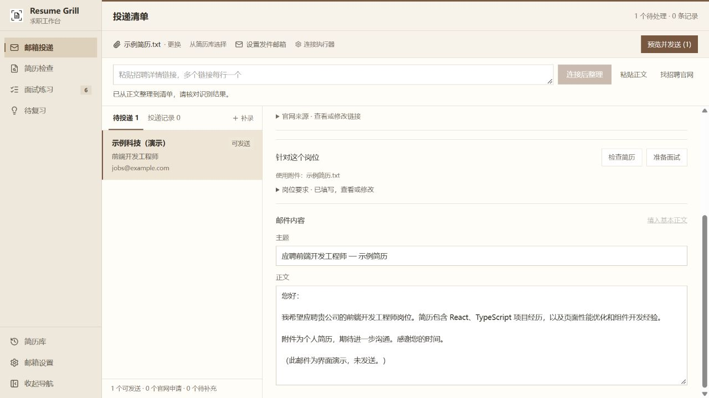
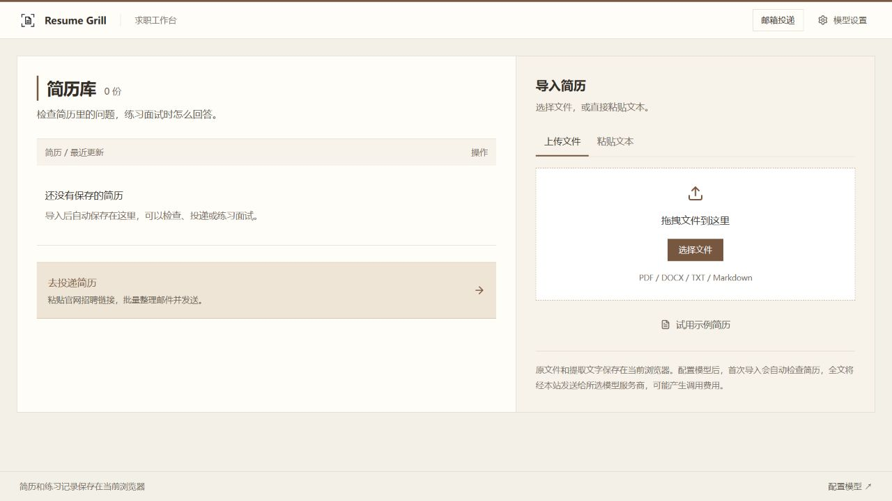
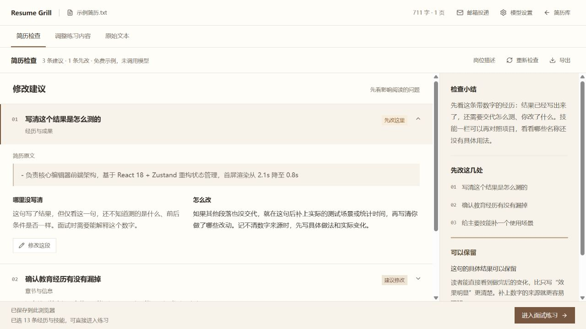
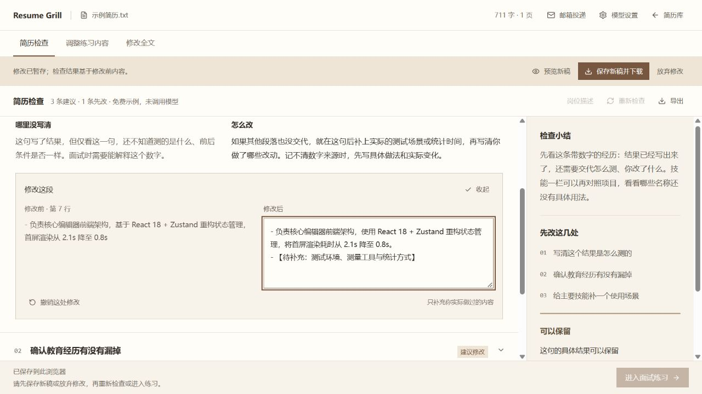
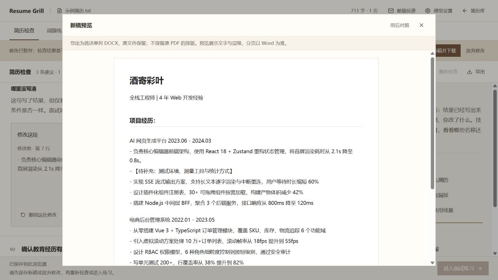
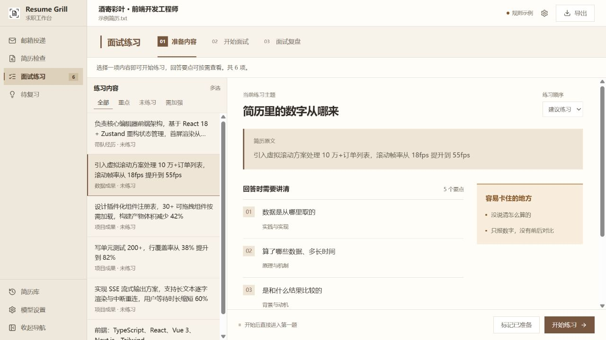
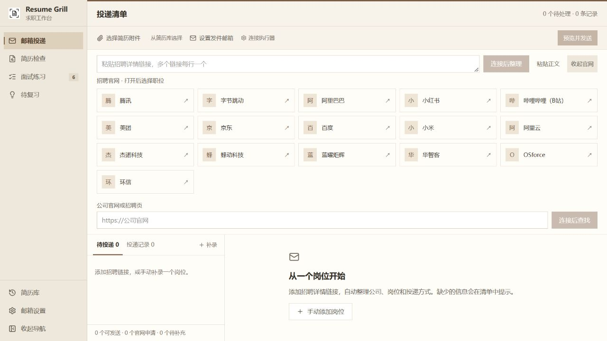

<p align="center">
  
</p>

<h1 align="center">Resume Grill</h1>

个人求职工作台，把简历修改、官网岗位整理、邮箱投递和面试准备放在一起。

你可以先导入简历，检查并修改内容；也可以从一个招聘链接开始，整理岗位要求，再用选好的简历投递或准备面试。各个入口可以独立使用，不必先走完一套流程。

## 能做什么

| 功能 | 用法 |
| --- | --- |
| 简历检查与修改 | 导入 PDF、DOCX、TXT、Markdown 或粘贴文本，检查内容、结构和表达；点击建议定位段落，对照实时 PDF 预览修改并保存新稿 |
| 官网岗位整理 | 浏览招聘官网入口，查找岗位链接，提取公司、岗位、招聘邮箱和岗位要求；读不到网页时可粘贴正文补充 |
| 邮箱投递 | 批量粘贴名单、招聘正文或导入 CSV，复用发件信息、简历和邮件模板，集中核对后通过 QQ／163 邮箱逐封发送 |
| 按岗位准备 | 从投递清单直接检查简历或准备面试，沿用岗位要求和所选附件，分别保存不同岗位与简历版本的记录 |
| 面试练习与复习 | 围绕简历中的经历和技能提问、追问，回看回答要点和复盘，将需要补充的知识加入待复习 |

目前适合个人本机使用或自用部署。模型分析需要自行配置兼容接口；官网整理和邮箱投递不依赖模型。公开服务的限制见下方「部署说明」。

## 界面预览

以下为此前版本的实际界面，简历和投递内容使用示例数据；投递页已更新为批量核对表格，截图待更新。

**投递工作台** · 整理岗位要求、选择附件、核对邮件内容。



<table>
  <tr>
    <td width="50%"><strong>简历库与导入</strong><br>保存简历，上传文件或粘贴正文。</td>
    <td width="50%"><strong>简历检查</strong><br>对照原文查看问题和修改建议。</td>
  </tr>
  <tr>
    <td><a href="docs/screenshots/home.jpg"></a></td>
    <td><a href="docs/screenshots/resume-review.jpg"></a></td>
  </tr>
  <tr>
    <td><strong>对照修改</strong><br>在建议旁修改段落，自动暂存草稿。</td>
    <td><strong>新稿预览</strong><br>新稿采用单列排版，保存后下载 PDF。截图展示早期版本。</td>
  </tr>
  <tr>
    <td><a href="docs/screenshots/resume-edit.jpg"></a></td>
    <td><a href="docs/screenshots/resume-preview.jpg"></a></td>
  </tr>
  <tr>
    <td><strong>面试准备</strong><br>选择项目经历，查看回答时需要讲清的内容。</td>
    <td><strong>招聘官网</strong><br>从公司官网入口选择具体岗位。</td>
  </tr>
  <tr>
    <td><a href="docs/screenshots/audit.jpg"></a></td>
    <td><a href="docs/screenshots/career-sites.jpg"></a></td>
  </tr>
</table>

## 快速开始

使用 **Node.js 22.13 或更新版本，建议 Node.js 24**。`.nvmrc`、CI 与容器统一使用 Node.js 24；使用 nvm 时可先运行 `nvm install 24` 和 `nvm use 24`。Node.js 20 不支持当前 PDF 阅读器的渲染 API。在项目目录运行：

```bash
npm ci
npm run dev
```

打开 [http://localhost:3000](http://localhost:3000)。

初次体验可以在简历库点击「试用示例简历」。示例的简历检查和初始练习内容使用内置规则，不消耗模型额度；连续问答、回答判断和复盘仍需要配置模型。仓库还提供了[示例材料](examples/README.md)。

只整理官网入口或粘贴招聘正文时，无需配置模型或连接邮箱。需要自动读取网页、查找链接或发送邮件时，再启动本机执行器。

## 使用流程

### 检查和修改简历

1. 导入简历或粘贴正文。文件在浏览器中解析，原文件与提取文本保存在当前浏览器。
2. 查看整份简历的检查结果。已配置模型时，新导入的简历会自动检查一次，也可以取消或跳过；重新打开已保存的简历不会自动重复调用模型。
3. 桌面上左侧显示检查建议，右侧显示实际 PDF。展开建议会定位相关段落，点击「定位并修改」或直接点击 PDF 段落即可编辑；也可以切到「修改全文」。窄屏通过「修改建议 / 简历预览」切换。修改会单独暂存，原来的检查结果继续保留，方便对照。
4. PDF 预览随修改更新，可切到「原文件」核对上传时的 PDF。点击「保存 PDF 并下载」，保存一份独立的新稿并下载当前预览对应的 PDF；原简历、原附件及其练习记录继续保留。

新稿采用简洁的单栏排版，不还原原 PDF 的版式，也不会覆盖电脑上的原文件。中文字体嵌入 PDF，文字可提取，换行与分页由同一排版逻辑处理；预览显示实际导出的文件。新稿的检查需要手动发起。返回投递页时，如果原先选的是这份原稿的同一版本，会切换到它的直接修改稿；其他自选附件和历史邮件附件保持原样。只有粘贴文本、尚未保存新稿时，没有可用于邮件投递的附件。

PDF 排版与预览在浏览器中完成，字体和 PDF 阅读器 Worker 随项目本地提供。字体不包含的字符会明确提示替换，避免导出缺字文件；字体授权与来源见 [public/fonts/README.md](public/fonts/README.md)。

检查针对提取出的文字，不评价原文件的字体和视觉排版。扫描版 PDF 没有可提取文字时，请先转成文本。简历正文上限为 20000 字，岗位描述上限为 12000 字。

模型请求不设置固定的输出 token 上限，面试历史也不再截断单轮回答。实际可用长度由所选模型和服务商决定；上述输入字数限制与请求超时仍保留。

### 从岗位开始准备

「邮箱投递」默认展示官网目录。点击公司名称打开原站；点击旁边的「读取」，在工作台选择官网中的职位并加入清单。公司、岗位、招聘邮箱和职责要求会一起带入，已有发件人和模板时也会自动填好邮件。也可以切到「名单 / 招聘正文」粘贴名单或导入 CSV。

- **能读取的页面**：首次连接本机执行器后继续刚才的读取；已有具体岗位链接可展开粘贴，多条逐个整理。一个招聘页包含多个职位时先选择岗位，不默认取第一条。岗位卡片、页签和 JobPosting 元数据均可读取；同一页可以添加不同职位。
- **邮箱选择**：优先使用岗位明确指定的联系人，没有独立联系人时使用页面中唯一的招聘邮箱。多个可能的邮箱留待选择，不自动猜测；页面未公开邮箱时仍需核对原站的投递方式。公司名称缺失时可按内置官网的准确域名补充，不根据未知域名猜公司。
- **读不到正文的页面**：在链接旁或岗位的官网来源中点击「粘贴正文补充」，复制一个具体职位的可见文字。此操作在浏览器本地完成，保留原链接和已有填写内容。
- **准备投递的岗位**：选好简历附件和岗位要求后，直接点击「检查简历」或「准备面试」，无需重复上传。

不同岗位、岗位要求或附件版本会分别保存诊断与练习记录。相同输入已有练习记录时直接打开；生成新内容可能产生模型调用费用。

内置入口包含腾讯、字节跳动、阿里巴巴、小红书、B站等公司，以及一批有前端岗位线索的公司官网。入口维护在 [career-sites.ts](src/data/career-sites.ts)，采集快照见 [岗位与投递入口](data/career-leads/latest.md)。快照保留来源和核对日期，岗位是否仍开放以官网为准。

### 发送求职邮件

在另一个终端运行：

```bash
npm run mail-agent
```

1. 在「投递设置」保存姓名、发件邮箱、默认简历和邮件模板。支持 `{{公司}}`、`{{岗位}}`、`{{姓名}}`、`{{发件邮箱}}`；名单未写岗位时可使用默认岗位。设置仅保存到当前浏览器。
2. 粘贴名单、招聘正文或导入 CSV，点击「整理到清单」。公司、岗位和邮箱可直接在表格补充，缺项集中显示；来源链接选填。草稿自动套用模板，手动修改的邮件保留。
3. 准备发送时，连接执行器，再在 QQ／163 邮箱开启 SMTP 服务、生成授权码并验证连接。Windows 可勾选「记住本机」加密保存，执行器重启后自动恢复邮箱；只整理名单、生成草稿无需连接。
4. 勾选这批要发送的岗位，点击「预览并发送」，集中核对收件人和主题，按需展开正文。确认邮件用途、内容和附件后发送；未选中、缺项和官网申请的条目继续保留。

每批最多 **20 封**，附件支持 **5 MB 以内的 PDF、DOCX、TXT**。执行器逐封发送，支持暂停和记录恢复；结果不确定的邮件会要求核对，不自动重发。「已提交邮箱」表示邮箱服务已接受邮件，不代表招聘方已读。

输入完整的 `@163.com` 地址会自动选择「网易 163 邮箱」，填写客户端授权码即可验证连接，无需填写 SMTP 服务器。当前网易支持普通 163 邮箱，126、yeah 和企业邮箱尚未接入。

有官网申请入口的岗位可以打开原站填写，并手动登记已投。当前不自动提交官网表单，也不支持 BOSS 直聘自动投递。

连接设置、失败处理、防重复规则及记录备份见 [邮箱投递使用说明](docs/email-applications.md)。

执行器的一键安装、自动启动与连接暂未实现，需求记录在 [issue #2](https://github.com/MIU-MA/resume-grill/issues/2)。

### 练习和复盘

识别出的经历与技能默认选中，按需在「调整练习内容」中删改，然后进入面试练习。选择一条经历开始问答，有未完成的练习时可以继续。

每条经历通常练习 **6–10 个问题**，顺着回答追问具体做法、选择理由、排查过程和结果判断，避免反复出同类问题。不懂的术语可以添加批注，解释后继续原问题，解释不占追问次数；回答与跳过合计最多 10 个问题，也可随时手动结束。

反馈先指出已经讲清的细节，再说最值得补的一点，不编项目故事或业绩数字。复盘区分没问到、跳过和问了还没讲清的内容，提供可用于修改简历的短句；待复习内容可跨简历保存。练习评分只反映本次回答，不代表实际工作能力或录用结果。

## 模型配置

使用支持 **OpenAI Chat Completions 协议及 JSON 输出**的服务。需要填写服务地址、API Key 和服务商提供的模型标识。

### 在网页中填写

打开「模型设置」，填写 `Base URL`、`API Key` 和 `Model`，保存并测试连接。测试连接会实际请求模型，也可能产生费用。

配置保存在当前浏览器的 `localStorage`。发起分析时，Key 和输入内容会提交给工作台后端，再由后端请求模型服务。因此，自填 Key 也需要信任承载工作台的服务器。

### 在服务端配置

参考 [.env.example](.env.example)，在项目根目录创建 `.env.local`，填入自己的配置：

```dotenv
OPENAI_BASE_URL=https://your-provider.example/v1
OPENAI_API_KEY=your-api-key
OPENAI_MODEL=your-model-id
```

示例值需要替换，三个变量必须全部填写。修改环境变量后重启应用。服务端配置的 Key 不会作为设置返回前端。

**实际调用优先使用完整的网页配置，未提供时才使用服务端配置。**

使用 Ollama 等本机或内网服务时，还需在服务端允许对应地址：

```dotenv
ALLOWED_LLM_BASE_URLS=http://127.0.0.1:11434
```

该配置按来源地址（协议、主机、端口）匹配，多个地址用逗号分隔；一旦设置，未列出的模型地址也会被拒绝。地址由工作台后端访问，远程部署时 `127.0.0.1` 指服务器自身。

## 数据保存与备份

| 数据 | 保存或发送位置 |
| --- | --- |
| 简历原文件、提取文本、修改草稿、新稿 | 当前浏览器 IndexedDB；解析、排版与 PDF 导出在浏览器中完成 |
| 检查结果、面试记录、待复习内容 | 当前浏览器 IndexedDB |
| 投递草稿、所选附件、默认姓名和邮箱、邮件模板、手动登记的官网申请 | 当前浏览器 IndexedDB |
| 网页填写的模型配置 | 当前浏览器 `localStorage`；调用时提交给工作台后端 |
| 模型分析的输入 | 简历文字、岗位描述及问答内容按操作经工作台后端发送至模型服务商 |
| 邮箱授权码 | 执行器内存；Windows 勾选「记住本机」后，由当前系统账户加密保存在 `.mail-agent/credentials.dpapi`，可在设置中忘记 |
| 邮件队列、发送记录与附件 | 本机项目的 `.mail-agent/` 目录；发送时经邮箱服务提交给收件人 |

分析简历时不上传原文件，发送求职邮件时会发送所选附件。招聘页读取由本机执行器向对应网站发起请求。

浏览器数据不会自动跨设备同步，清理站点数据会删除本地记录。检查和练习报告可以导出 Markdown，练习记录可以导出 JSON；JSON 不包含简历附件或全部工作台数据。邮件记录需要单独备份整个 `.mail-agent/` 目录。

## 部署说明

本机或自用服务器可按以下方式构建并运行网页：

```bash
npm ci
npm run build
npm start
```

仓库也包含 [Dockerfile](Dockerfile) 和 [Compose 配置](docker-compose.yml)，基础镜像使用 Node.js 24。容器只运行网页，不包含用户本机的邮箱执行器。

若准备上线供用户自行填写模型 Key，建议不在服务器预置可供所有请求回退使用的 Key。当前没有用户账户和独立额度管理，只有简单的进程内 IP 限流；公开服务仍需完善访问控制和密钥处理。

网页部署到线上后，自动读取招聘页和发送邮件仍需要用户在自己的电脑启动执行器，并指定网页来源。例如在 PowerShell 中：

```powershell
$env:MAIL_WORKBENCH_ORIGIN='https://your-workbench.example'
npm run mail-agent
```

执行器监听 `127.0.0.1:4318`，不应暴露到公网。浏览器可能要求允许访问本地网络；线上网页连接本机执行器的浏览器兼容性尚未全面验证，详细限制见 [连接说明](docs/email-applications.md#网页部署后的连接方式)。

## 开发

技术栈：Next.js、React、TypeScript、Tailwind CSS。简历解析使用 PDF.js / mammoth，本地存储使用 IndexedDB，邮件发送使用 Nodemailer。

```text
app/                  页面路由、模型 API 与全局样式
src/application/      应用入口、导航与跨模块流程编排
  hooks/              工作台状态、简历与练习流程
src/features/         简历、投递、面试、复盘等业务模块
  <模块>/hooks/       模块专用的状态和交互
  <模块>/lib/         模块专用的解析、存储、提示词与导出
src/components/ui/    通用视觉控件
src/hooks/            与业务无关的通用交互
src/domain/           共享业务契约、校验与纯规则
src/lib/              跨模块存储、模型设置与服务端基础设施
src/providers/        模型接口与示例实现
src/mail-agent/       招聘页面读取、SMTP 和发送队列
src/data/             内置招聘官网入口
scripts/              本机执行器与采集脚本入口
data/career-leads/    官网岗位采集快照
examples/             示例简历和岗位描述
docs/                 功能说明与项目截图
```

目录、命名、依赖边界和后续开发规则见 [AGENTS.md](AGENTS.md)，业务模块说明见 [src/features/README.md](src/features/README.md)。新增逻辑先归属业务模块；通用层不得反向依赖业务层，模块间不添加汇总导出文件。目录检查已接入 CI，会检查导入路径、分层边界与运行时循环依赖。

提交前检查：

```bash
npm run check:architecture
npm run lint
npx tsc --noEmit
npm test
npm run build
```

需要刷新仓库中配置的官网采集快照时运行：

```bash
npx tsx scripts/crawl-careers.ts
```

脚本按 [crawlCareerSites](src/data/career-sites.ts) 中的地址采集，覆盖 `data/career-leads/latest.md` 和 `latest.json`，不发送邮件或提交申请，也不更新人工核对日期。

## 许可证

[MIT](LICENSE)
